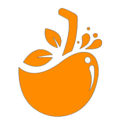
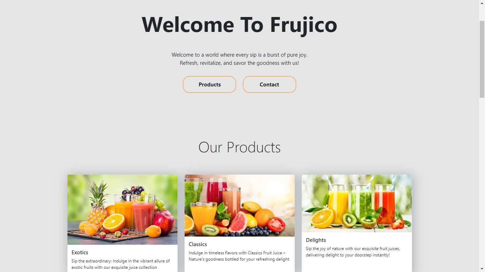

    

        <h1 align="center">FRUJICO</h1>

    

About Us
========
**Fruijico** is passionate about creating fruit drinks that go beyond sustenance.
We prioritize using fresh ingredients and innovative recipes to offer delicious 
and meaningful products. Sustainability and ethical sourcing are key principles, 
and We donate a portion of profits to support food insecurity and sustainability 
initiatives.

At **Frujico**, we are more than just a fruit drink company.
We are a community of people who believe that fruit drinks have the 
power to bring people together and make the world a better place.
We in the power of fruit drinks to unite people and improve the world, 
inviting you to be a part of our culinary journey.
______

# What is this ?

This is a website concept for a fictional company which sells fruit drinks.
______

# ⤓ Installation

### 👁️ Just for viewing.

- Step 1: Clone this repository or Download it through the Google Drive Folder provided below.

- Step 2: Go to the respective folder where you downloaded/cloned the folder/repository and open the index file with a browser.

### ⚙️ Development purposes.

- step 1: Clone this repository or Download it through the Google Drive Folder provided below.

- step 2: Download [VS Code](https://code.visualstudio.com/).

- step 3: Download [Live Server](https://marketplace.visualstudio.com/items?itemName=ritwickdey.LiveServer) extension in VS Code.

- step 4: Then open the respective folder in VS Code.

- step 5: Click `Go Live` in the bottom right corner to host a server to view the website.

Our Google Drive Folder - [link](https://drive.google.com/drive/folders/1Nih_PqeWK_hcqIJ9ykpSHvg6Y7-Nav70).
______

# Credits
## 🖼 Image courtesy

- Images taken from [Google Images](https://www.google.com/search?q=fruit+drink&sca_esv=578489342&tbm=isch&sxsrf=AM9HkKlwCemIY-xzHW2nHoWsyudLhY3rIg:1698848515808&source=lnms&sa=X&ved=2ahUKEwjxjL_y_6KCAxWX4mEKHQebD8IQ_AUoAXoECAIQAw&biw=1745&bih=885&dpr=1.1) and
[Wallpaperset](https://wallpaperset.com).

## </> Code References

- [W3School](https://www.w3schools.com/) for code enhancements.

- [Devbeep](https://devbeep.com/), [Bootstrap](https://getbootstrap.com/), [geeksforgeeks](https://www.geeksforgeeks.org/), [Tutorialspoint](https://www.tutorialspoint.com/index.htm), [StackOverflow](https://stackoverflow.com/) and [Programiz](https://www.programiz.com/html) for HTML and JavaScript references.

## Web Framework

- [Bootstrap](https://getbootstrap.com/).

______

# Contributors

Samaka Pelige
 
Chamithu Vithanage
 
Dinsara Ilukpitiya
 
Sudiv Jayathilake

Team Name: **The CODE-IALS**

______

### Note

This is a project done for the BTUI Competitions held by the Royal College.